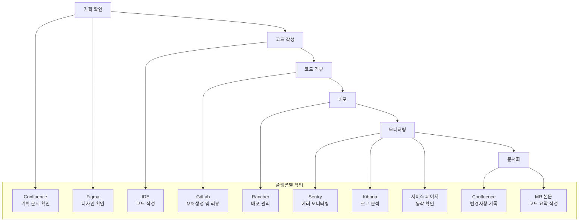
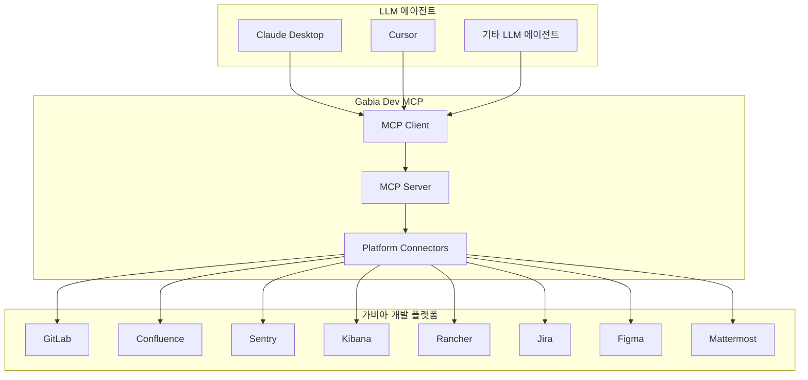

# Gabia Dev MCP

**LLM이 가비아 개발자의 업무 플랫폼을 직접 활용하여 자동화의 다음 단계로 도약하는 프로젝트**

[Demo](https://gitlab.gabia.com/gm2302028/gabia-dev-mcp/-/issues/1)

## 사용법

1. [JDK 21](https://www.oracle.com/kr/java/technologies/downloads/#java21) 을 설치합니다.
2. Cursor, Claude Desktop 과 같은 클라이언트를 준비합니다.
3. [최신 Release](https://gitlab.gabia.com/gm2302028/gabia-dev-mcp/-/releases)에서 `gabia-dev-mcp-server.jar`를 다운로드합니다.

## MCP 설치 가이드


<details>
<summary><strong>Cursor 설정</strong></summary>

Cursor에서 MCP 서버를 사용하려면 설정에서 MCP 서버를 등록해야 합니다.

### 설정 방법

1. Cursor 설정을 열고 MCP 서버 섹션으로 이동합니다.
2. 새로운 MCP 서버를 추가합니다.
3. 다음 설정을 입력합니다:

```json
{
  "name": "gabia-dev-mcp",
  "command": "java",
  "args": [
    "-jar",
    "/path/to/gabia-dev-mcp-server-1.0.0.jar"
  ],
  "env": {
    "GITLAB_API_URL": "https://gitlab.gabia.com/api/v4",
    "GITLAB_TOKEN": "your_gitlab_token",
    "CONFLUENCE_BASE_URL": "https://confluence.gabia.com",
    "ATLASSIAN_OAUTH_ACCESS_TOKEN": "your_confluence_token",
    "FIGMA_API_KEY": "your_figma_api_key",
    "MATTERMOST_TOKEN": "your_mattermost_token",
    "ORACLE_HOST": "your_oracle_host",
    "ORACLE_PORT": "1521",
    "ORACLE_SID": "DEVGABIA",
    "ORACLE_USERNAME": "your_username",
    "ORACLE_PASSWORD": "your_password",
    "MEMORY_FILE_PATH": "memory.json"
  }
}
```

자세한 설정 방법은 [Cursor MCP 문서](https://docs.cursor.com/context/mcp)를 참조하세요.

</details>

<details>
<summary><strong>Codex CLI 설정</strong></summary>

Codex CLI는 `~/.codex/config.toml` 파일의 `mcp_servers` 섹션을 통해 MCP 서버를 설정합니다. 포맷은 TOML이며 JSON과 다릅니다.

- 중요: 최상위 키는 `mcp_servers` 입니다 (`mcpServers` 아님).
- macOS 경로: `~/.codex/config.toml`

```toml
[mcp_servers.gabia-dev-mcp]
command = "java"
args = ["-jar", "/path/to/gabia-dev-mcp-server-1.0.0.jar"]

[mcp_servers.gabia-dev-mcp.env]
GITLAB_API_URL = "https://gitlab.gabia.com/api/v4"
GITLAB_TOKEN = "your_gitlab_token"
CONFLUENCE_BASE_URL = "https://confluence.gabia.com"
ATLASSIAN_OAUTH_ACCESS_TOKEN = "your_confluence_token"
FIGMA_API_KEY = "your_figma_api_key"
MATTERMOST_TOKEN = "your_mattermost_token"
ORACLE_HOST = "your_oracle_host"
ORACLE_PORT = "1521"
ORACLE_SID = "DEVGABIA"
ORACLE_USERNAME = "your_username"
ORACLE_PASSWORD = "your_password"
MEMORY_FILE_PATH = "memory.json"
```

</details>

<details>
<summary><strong>Claude Desktop 설정</strong></summary>

Claude Desktop의 설정 파일에 다음 내용을 추가합니다:

**Windows**: `%APPDATA%\Claude\claude_desktop_config.json`\
**macOS**: `~/Library/Application Support/Claude/claude_desktop_config.json`

```json
{
  "mcpServers": {
    "gabia-dev-mcp": {
      "command": "java",
      "args": [
        "-jar",
        "/path/to/gabia-dev-mcp-server-1.0.0.jar"
      ],
      "env": {
        "GITLAB_API_URL": "https://gitlab.gabia.com/api/v4",
        "GITLAB_TOKEN": "your_gitlab_token",
        "CONFLUENCE_BASE_URL": "https://confluence.gabia.com",
        "ATLASSIAN_OAUTH_ACCESS_TOKEN": "your_confluence_token",
        "FIGMA_API_KEY": "your_figma_api_key",
        "MATTERMOST_TOKEN": "your_mattermost_token",
        "ORACLE_HOST": "your_oracle_host",
        "ORACLE_PORT": "1521",
        "ORACLE_SID": "DEVGABIA",
        "ORACLE_USERNAME": "your_username",
        "ORACLE_PASSWORD": "your_password",
        "MEMORY_FILE_PATH": "memory.json"
      }
    }
  }
}
```

</details>

### 환경 변수 설정

각 플랫폼의 토큰을 발급받아 설정해야 합니다:

- **GitLab**: Personal Access Token 생성 (API 권한 필요)
- **Confluence**: Atlassian OAuth Token 또는 Personal Access Token
- **Figma**: Personal Access Token 생성
- **Mattermost**: Personal Access Token 생성
- **Oracle**: 데이터베이스 연결 정보 (호스트, 포트, SID, 사용자명, 비밀번호)


## 프로젝트 개요

개발자의 일상적인 업무를 생각해보면, 서비스 페이지부터 GitLab, Figma, Confluence, Mattermost, Sentry, Kibana, Rancher, Jira, IDE까지 정말 많은 플랫폼을 오가며 작업합니다.




예를 들어, Confluence나 Figma에서 기획 내용을 확인하고,IDE에서 코드를 작성한 다음, GitLab을 통해 코드 리뷰를 받아 배포합니다. 배포 후에는 Rancher와 페이지에 접속해서 정상 동작을 확인하고, Sentry를 통해 에러가 있는지 모니터링합니다. 

이런 과정에서 반복적으로 수행해야 하는 작업들이 정말 많았습니다. 우리는 코드 포맷팅, CI 파이프라인, MR 템플릿 등을 통해 최대한 자동화를 적용해왔지만, 여전히 해결하지 못한 부분들이 있었습니다.  MR 본문에 코드의 핵심을 요약해서 작성하거나, Confluence에 변경사항 기록하기와 같은 작업은 규칙 기반으로는 한계가 있었습니다.


## 해결 방안

최근 LLM 챗봇이 상용화되면서 업무에 활용하는 사례가 늘어났습니다. 그런데 이런 반복 작업을 할 때마다 우리는 비슷한 패턴을 반복합니다. 코드나 정보를 챗봇에 복사해서 붙여넣고, 원하는 결과를 만들어달라고 요청한 다음, 나온 결과를 다시 복사해서 실제 플랫폼에 붙여넣는 식이죠.  이 과정이 생각보다 많은 시간을 잡아먹습니다. 특히 같은 종류의 작업을 반복할 때마다 이런 복사-붙여넣기 과정을 거쳐야 한다는 게 정말 번거롭고 비효율적이었습니다.

만약 우리가 정보를 복사-붙여넣기하는 대신 LLM 이 직접 정보를 확인-기록하도록 하면 어떻게 될까요? LLM이 필요한 정보를 판단하고 직접 수집해 결과물의 질이 올라 갑니다. 또한 위와 같은 번거로운 과정을 제거해 업무 생산성을 극대화할 수 있습니다.

이 프로젝트에서는 MCP, 특히 Function Call (Tools) 기능을 활용해 LLM 이 플랫폼의 정보를 확인-기록할 수 있도록하는 기능을 구현합니다.

## 기술 스택

### MCP (Model Context Protocol)
- **Function Call (Tools)** 기능을 활용한 플랫폼 연동
- **이식성**: Claude Desktop, Cursor 등 다양한 에이전트에서 활용 가능
- **표준화된 프로토콜**: JSON-RPC 2.0 기반 통신

### 지원 플랫폼 및 도구

| 플랫폼 | 도구명 | 기능 | 설명 |
|--------|--------|------|------|
| **GitLab** | `get_merge_request` | MR 기본 정보 조회 | MR의 제목, 설명, 상태, 작성자 등 기본 정보를 조회합니다 |
| **GitLab** | `get_merge_request_diffs` | MR 코드 변경사항 조회 | MR의 코드 변경사항(diff)을 조회합니다 |
| **GitLab** | `mr_discussions` | MR 토론 및 리뷰 조회 | MR의 코드 리뷰, 토론, 댓글을 조회합니다 |
| **GitLab** | `create_merge_request` | MR 생성 | 새로운 병합 요청을 생성합니다 |
| **GitLab** | `list_merge_requests` | MR 목록 조회 | 다양한 필터 옵션과 함께 MR 목록을 조회합니다 |
| **GitLab** | `create_issue` | 이슈 생성 | GitLab 프로젝트에 새로운 이슈를 생성합니다 |
| **GitLab** | `list_issues` | 이슈 목록 조회 | 프로젝트 또는 모든 접근 가능한 프로젝트의 이슈 목록을 조회합니다 |
| **GitLab** | `get_issue` | 이슈 상세 조회 | GitLab 프로젝트의 특정 이슈 상세 정보를 조회합니다 |
| **GitLab** | `update_issue` | 이슈 수정 | GitLab 프로젝트의 이슈를 수정합니다 |
| **GitLab** | `delete_issue` | 이슈 삭제 | GitLab 프로젝트에서 이슈를 삭제합니다 |
| **GitLab** | `my_issues` | 내 이슈 조회 | 인증된 사용자에게 할당된 이슈 목록을 조회합니다 (기본값: 열린 이슈) |
| **GitLab** | `list_issue_discussions` | 이슈 토론 조회 | GitLab 프로젝트의 이슈에 대한 토론 목록을 조회합니다 |
| **GitLab** | `create_issue_note` | 이슈 노트 생성 | 기존 이슈 스레드에 새로운 노트를 추가합니다 |
| **GitLab** | `update_issue_note` | 이슈 노트 수정 | 기존 이슈 스레드 노트를 수정합니다 |
| **GitLab** | `list_issue_links` | 이슈 링크 목록 조회 | 특정 이슈의 모든 이슈 링크를 조회합니다 |
| **GitLab** | `get_issue_link` | 이슈 링크 조회 | 특정 이슈 링크를 조회합니다 |
| **GitLab** | `create_issue_link` | 이슈 링크 생성 | 두 이슈 간의 이슈 링크를 생성합니다 |
| **GitLab** | `delete_issue_link` | 이슈 링크 삭제 | 이슈 링크를 삭제합니다 |
| **Confluence** | `confluence_search` | 문서 검색 | 단순 텍스트 또는 CQL로 Confluence를 검색하고, 간단한 JSON 결과를 반환합니다 |
| **Confluence** | `confluence_get_page` | 페이지 상세 조회 | page_id 또는 (title + space_key)로 페이지 상세를 조회하고, HTML/Markdown 본문과 메타데이터를 반환합니다 |
| **Confluence** | `confluence_create_page` | 페이지 생성 | 스페이스/제목/본문으로 새 페이지를 생성합니다 (markdown/wiki/storage 지원) |
| **Confluence** | `confluence_update_page` | 페이지 수정 | 페이지 ID로 제목/본문/부모/버전을 업데이트합니다 |
| **Confluence** | `confluence_delete_page` | 페이지 삭제 | 페이지 ID로 페이지를 삭제합니다 |
| **Confluence** | `confluence_add_comment` | 댓글 추가 | 페이지 ID에 댓글을 추가합니다 |
| **Figma** | `get_figma_data` | Figma 파일 데이터 조회 | 레이아웃, 콘텐츠, 시각적 요소, 컴포넌트 정보를 포함한 포괄적인 Figma 파일 데이터를 조회합니다 |
| **Figma** | `download_figma_images` | Figma 이미지 다운로드 | 이미지 또는 아이콘 노드의 ID를 기반으로 Figma 파일에서 사용된 SVG 및 PNG 이미지를 다운로드합니다 |
| **Memory** | `create_entities` | 엔터티 생성 | 그래프에 새 엔터티를 여러 개 생성합니다 |
| **Memory** | `create_relations` | 관계 생성 | 엔터티 간 관계를 생성합니다 (능동태로 기술) |
| **Memory** | `add_observations` | 관찰 추가 | 기존 엔터티에 관찰 텍스트를 추가합니다 |
| **Memory** | `delete_entities` | 엔터티 삭제 | 엔터티 및 관련 관계를 삭제합니다 |
| **Memory** | `delete_observations` | 관찰 삭제 | 특정 엔터티의 일부 관찰을 삭제합니다 |
| **Memory** | `delete_relations` | 관계 삭제 | 관계를 다건 삭제합니다 |
| **Memory** | `read_graph` | 그래프 조회 | 전체 지식 그래프를 조회합니다 |
| **Memory** | `search_nodes` | 노드 검색 | 이름/타입/관찰 내용으로 노드를 검색합니다 |
| **Memory** | `open_nodes` | 노드 열기 | 이름 목록으로 노드/관계를 조회합니다 |

## Memory 기능 (성장형 LLM 지식 그래프)

업무 중 습득한 암묵지나 반복적으로 참고할 노하우를 LLM이 스스로 저장/갱신해 다음 작업에서 더 잘 수행하도록 돕는 기능입니다. 라인 기반 JSONL(`memory.json`)로 간단하고 투명하게 저장하며, 엔터티-관계-관찰로 구성된 경량 지식 그래프를 제공합니다.

- 저장 위치: `MEMORY_FILE_PATH` 환경 변수로 지정. 절대경로 또는 파일명만 지정 가능. 파일명만 지정하면 JAR 실행 경로 기준으로 저장됩니다. 기본값은 `memory.json`.
- 포맷: 각 줄에 하나의 JSON 객체가 기록됩니다. `type`이 `entity` 또는 `relation`.

### 사용 예시

1) 엔터티 생성

```
tool: create_entities
args: {
  "entities": [
    { "name": "gabia-logging-guide", "entityType": "doc", "observations": [
      "Sentry 이슈 링크는 MR 본문에 첨부",
      "Kibana 쿼리는 팀 공통 DSL 사용"
    ]}
  ]
}
```

2) 관계 생성 (능동태)

```
tool: create_relations
args: {
  "relations": [
    { "from": "gabia-logging-guide", "to": "Sentry", "relationType": "references" }
  ]
}
```

3) 관찰 추가

```
tool: add_observations
args: {
  "observations": [
    { "entityName": "gabia-logging-guide", "contents": [
      "Error budget은 월별 99.9% 초과 시 알림"
    ]}
  ]
}
```

4) 검색 및 열람

```
tool: search_nodes
args: { "query": "Sentry" }

tool: open_nodes
args: { "names": ["gabia-logging-guide"] }
```

### 설계 메모

- 안정성: 파일 접근은 뮤텍스로 직렬화하여 동시성 안전성을 확보했습니다.
- 중복 방지: 동일 이름의 엔터티, 동일 삼중항(from,to,relationType) 관계는 중복 기록하지 않습니다. 관찰도 중복을 걸러 추가합니다.
- 이식성: MCP Tool 스키마는 단순 JSON으로 설계해 Claude, Cursor, Codex CLI 등에서 동일하게 사용 가능합니다.
- 투명성: 파일은 사람이 읽고 편집 가능한 형태이므로, 필요 시 Git으로 버전 관리할 수 있습니다.
| **Oracle** | `oracle_execute_select` | SELECT 쿼리 실행 | Oracle 데이터베이스에서 SELECT 쿼리를 실행하고 결과를 반환합니다 (세미콜론 자동 제거 지원) |
| **Oracle** | `oracle_test_connection` | 연결 테스트 | Oracle 데이터베이스 연결 상태를 테스트합니다 |
| **Mattermost** | - | 알림 및 커뮤니케이션 | - |
| **Sentry** | - | 에러 모니터링 및 분석 | - |
| **Kibana** | - | 로그 분석 | - |
| **Rancher** | - | 컨테이너 관리 | - |
| **Jira** | - | 이슈 트래킹 | - |


## 아키텍처



## 참고 자료

- [Model Context Protocol 공식 문서](https://modelcontextprotocol.io/docs/getting-started/intro)
- [MCP 아키텍처 개요](https://modelcontextprotocol.io/docs/learn/architecture)
- [MCP Python SDK 문서](https://github.com/modelcontextprotocol/python-sdk)
